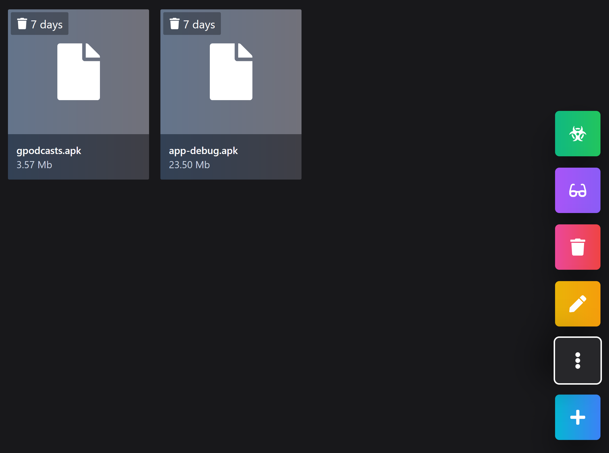

## Fileway

Local network file sharing



## Running in development

### Server

```
// Update dependencies
npm i

// Update database
npx prisma migrate dev

// Update prisma client
npx prisma generate

// Start server
npm run dev
```

### Client

```
// Update dependencies
npm i

// Start client
npm run dev
```

```
// Expose client to network
// loads .env.host, convenient for defining VITE_API_URL with the current network ip
npm run host
```

## Running in production

```
sudo docker compose up -d --build
```

## Environment variables

Follow .env.example

### Client

Loads .env.development on npm run dev, .env.host on npm run host and .env.production on npm run build
